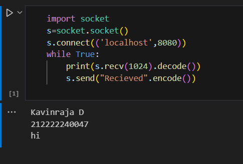
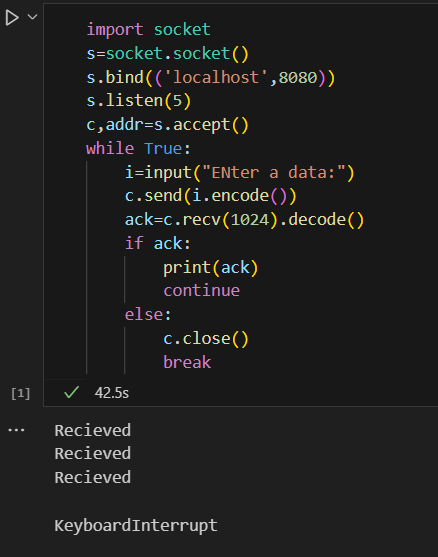

# 19CS406-EX-1 STUDY OF SOCKET PROGRAMMING WITH CLIENT-SERVER MODEL

# DATE :

# AIM :
## To write a python program to perform stop and wait protocol
# ALGORITHM :
## 1. Start the program.
## 2. Get the frame size from the user
## 3. To create the frame based on the user request.
## 4. To send frames to server from the client side.
## 5. If your frames reach the server it will send ACK signal to client otherwise it will sendNACK signal to client.
## 6. Stop the program

# CLIENT PROGRAM :
```PYTHON 3
## Developed By : Kavinraja D
## Reg No : 212222240047
import socket
s=socket.socket()
s.bind(('localhost',8080))
s.listen(5)
c,addr=s.accept()
while True:
	i=input("ENter a data:")
	c.send(i.encode())
	ack=c.recv(1024).decode()
	if ack:
		print(ack)
		continue
	else:
		c.close()
		break
```
# SERVER PROGRAM : 
```PYTHON 3
import socket
s=socket.socket()
s.connect(('localhost',8080))
while True:
	print(s.recv(1024).decode())
	s.send("Recieved".encode())
```

# SERVER OUTPUT :


# CLIENT OUTPUT : 


# RESULT:
## Thus, python program to perform stop and wait protocol was successfully executed.
